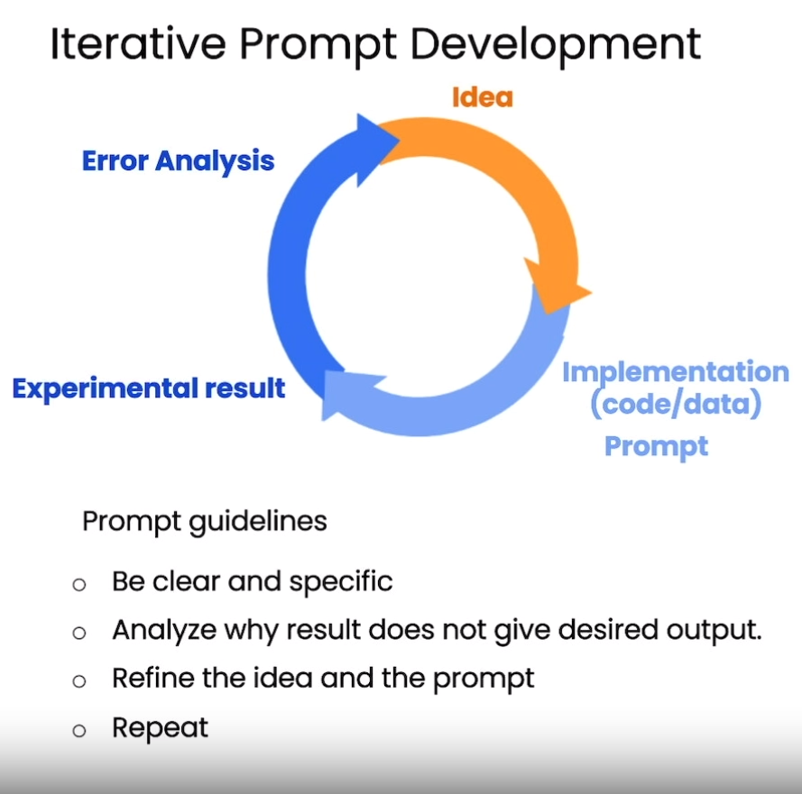
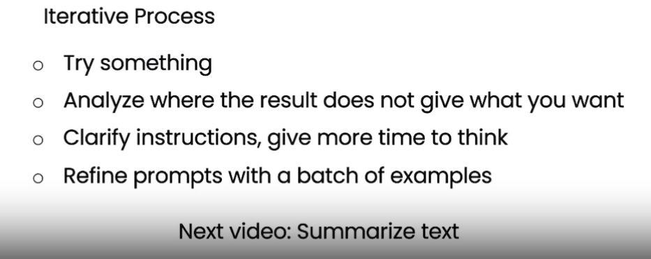

# Iterative

In this lesson we learn about the Iterative approach to creating prompts

- We can limit the number of characters a prompt can generate by specifiying "at most" 50 words / 3 sentences / 280 characters / 1 paragraph / etc..

- You can also add guidelines or tell the AI to specify the Product ID at the end of the description. This is useful for Mass Generating Ecommerce Websites with Product Codes, Reviews, Customer Recommedations mixed with advanced algorithms. 

- You can also ask ChatGPT to format this data into a table with HTML... wow it does quite a great job.. It can follow code patterns as well.

- Being a good prompt engineer isn't about creating the perfect prompt, it's about the process of evaluating prompts

 [label](README.md)