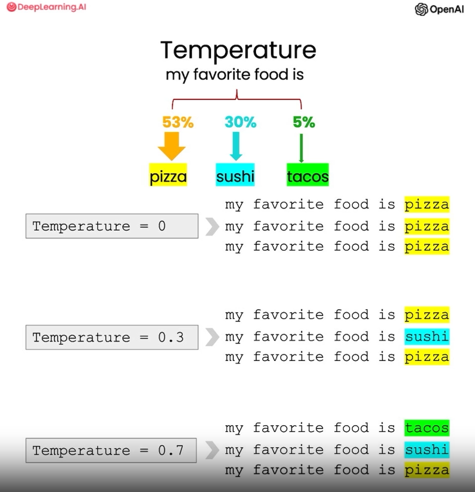

# Expanding

In this lesson we learn about Expanding

- We can expand our AI to respond to content such as customer responses.

- There is a parameter called "Temperature" to vary responses based on predictions by adding a randomness index or "weight"

- "Temperature" 0.7 gives a different response everytime

