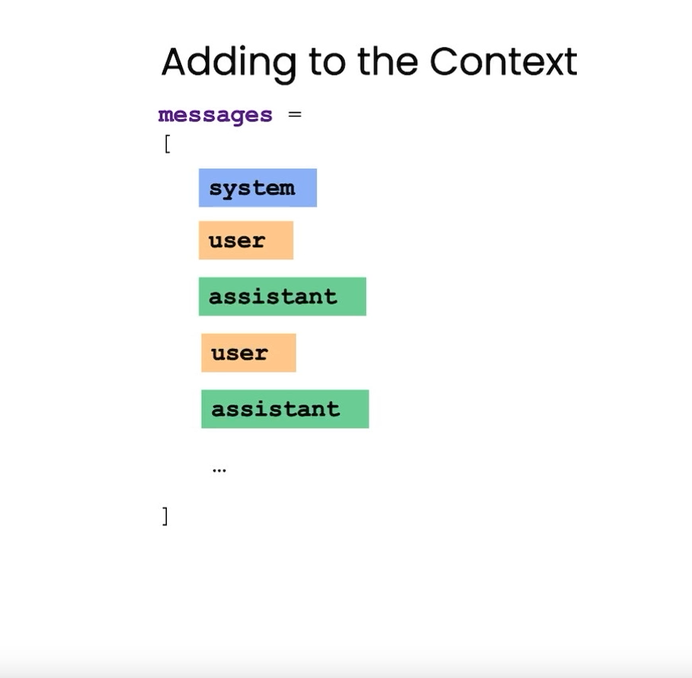

# Chatbot

In this lesson we learn the basics of creating a Chatbot whether it is for a Customer Service Agent or a Restaurant Order Taker

- You can set "roles" for your Chatbot so that they can Envelope certain Personas. (This is gonna replace a lot of jobs..)

- You can program a Robot to take orders, all you need to do is specify all instructions it needs to follow as well as letting it know the prices and menu.

- You can export the order summary to the "system" assigned Chatbot to record orders for users. Incase customers want to reorder the same thing.

